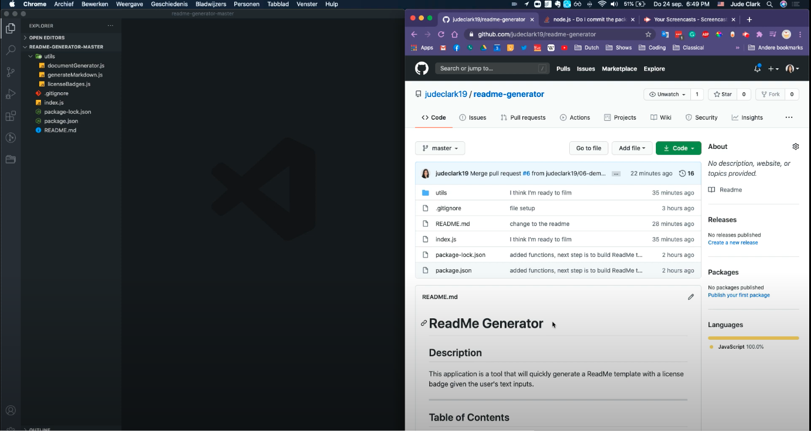

# ReadMe Generator

## Description
This application is a tool that will quickly generate a ReadMe template with a license badge given the user's text inputs.
***

## Table of Contents

* [Installation](#installation)
* [Usage](#usage)
* [License](#license)
* [Contributing](#contributing)
* [Tests](#tests)
* [Questions](#questions)

***

## Installation and Usage

### Walkthrough video (02:26)

Click thumbnail above to be redirected to YouTube.

### Installation steps
1. Download the files in [this repository](https://github.com/judeclark19/readme-generator).
2. Open the folder in VS Code.
3. Run terminal in VS Code (Terminal > New Terminal).
4. Make sure your terminal is targeting the current directory, and then run "npm install".

#### Usage steps
1. Run your terminal and make sure it is targeting the current directory.
2. Run "node index.js"
3. Answer the subsequent prompts in the terminal.
4. A new file called "GeneratedReadMe.md" is created, containing your new ReadMe!

## License

## Contributing
If you would like to contribute to this project, please [add me on GitHub](https://github.com/judeclark19).

## Questions
Please reach out Jude Clark at judeclark2019@gmail.com.

